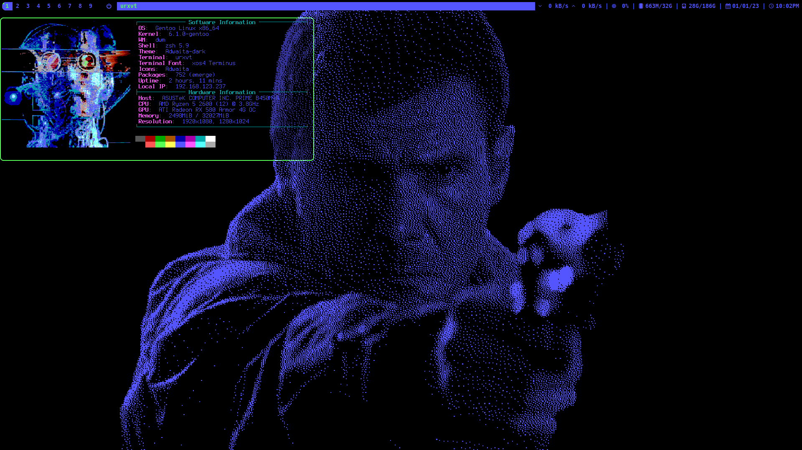
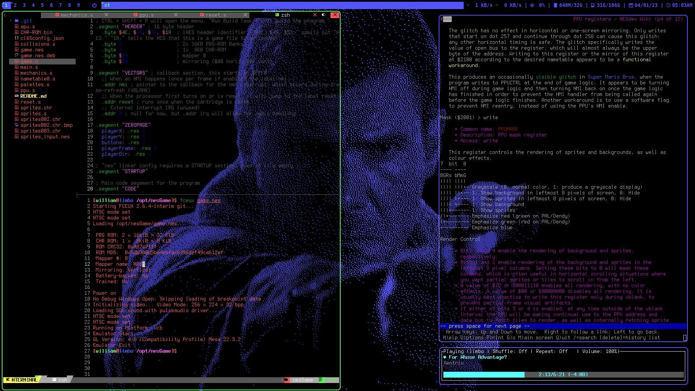
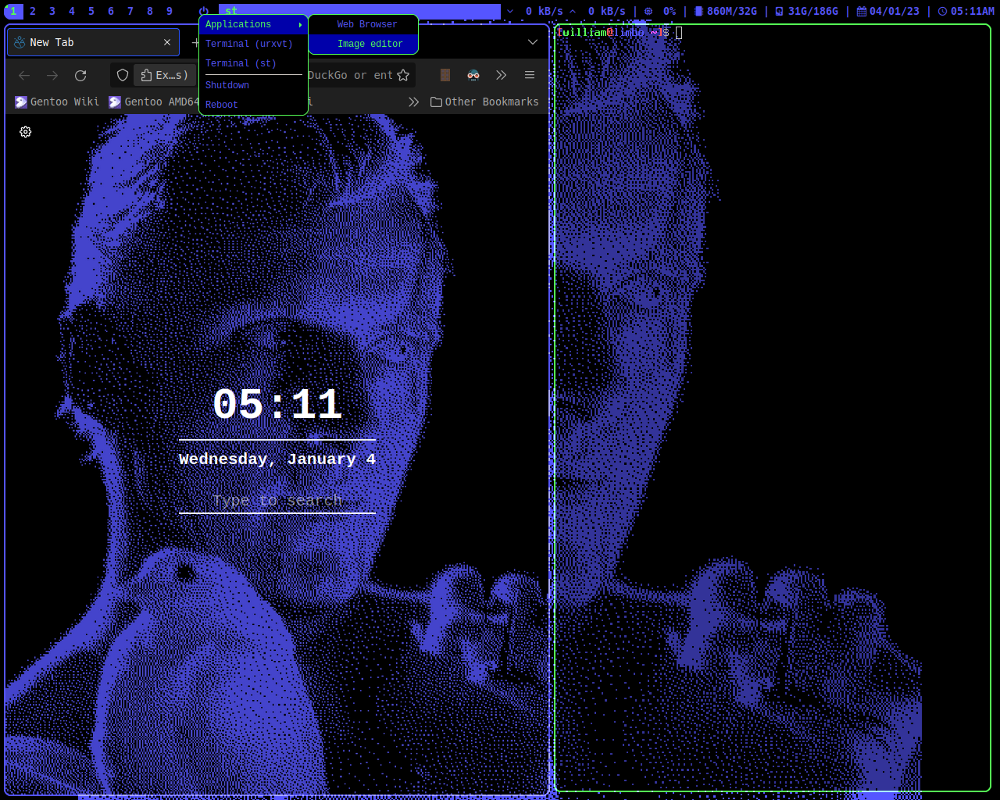

# tyrellRice
My EGA, cyberpunk-themed gentoo rice:
## What's included:
1. **My builds of:**
     - [dwm](http://dwm.suckless.org/)
     - [st](http://st.suckless.org/)
     - [dmenu](http://tools.suckless.org/dmenu/)
     - [dwmblocks](https://github.com/torrinfail/dwmblocks)
2. **Personal Scripts**
     - powermenu ([xmenu](https://github.com/phillbush/xmenu) required).
     - utilities (screenshot, display image, etc.)
     - statusbar scripts
3. **Misc. configs**
     - .Xresources
     - neofetch
4. **Screenshots**
     
     
     
## What's **not** included:
1. Wallpapers and other resources
   - I made them pretty easily with a program I wrote in C that scales, [dithers](https://www.youtube.com/watch?v=lseR6ZguBNY&t=1385s), then colors an image. It uses the [stb_image](https://github.com/nothings/stb/blob/master/stb_image.h) library for file operations. I'll probably make a repo for it when it's more complete.
2. Neovim config
   - It's just [nvchad](https://github.com/NvChad/NvChad) with a custom [EGA theme](ega.lua).
